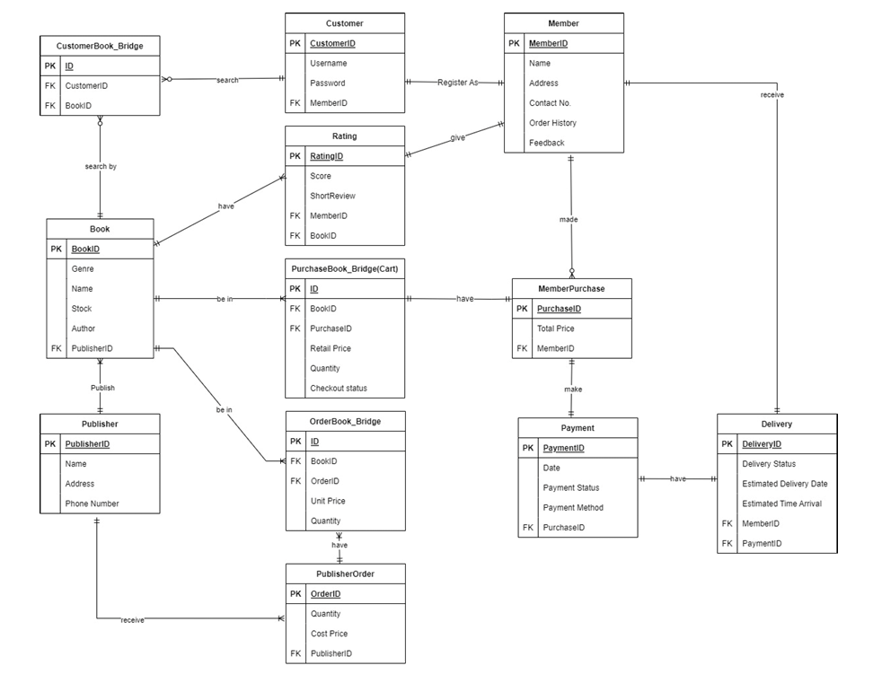

# E-BookStore-Database-System

This is an e-bookstore database system created with SQL using MSSQL.

Group Member : <a href="https://github.com/AdaMC2212">**Yong Xiang**</a>, <a href="https://github.com/sebasdiii">**Weng Thim**</a> 

## Introduction to Database Management

- Worked as part of a team to build a relational database for an  
- E-bookstore using MSSQLServer. 
- Applied Business Rules, Normalisation up to 3rd Normal Form
- Applied Data Definition Language and Data Manipulation Language
- Responsible for establishing relationships between entities in an ERD

---

## Scenario

A Bookstore located in Kuala Lumpur Malaysia has vast collection of books in its warehouse. The bookstore ordered books of various genres from different publishers and sell them to the customers. As their business grows, the bookstore would like to implement an online store to facilitate the purchase of books to more customers. Your team is assigned the project to design and implement a database system for online E-Bookstore Database System. 

- Publishers frequently send lists of latest books to the e-bookstore manager. The bookstore manager compiles a list of needed books and sends an order to the publishers. The publisher supplies the ordered books to the bookstore. The bookstore manager records the details of the order and books that have arrived at the bookstore. The orders sent to publishers need to be recorded in the database 
- Customers, who wish to purchase books online, need to initially register as members. Members will be able to view the book, read reviews and provide review for the books.
- Members who wish to purchase can select their books into the shopping cart. The cart will show the summary of the selection and total cost to be paid. Once the payment is made, the order is confirmed, the bookstore will send the books to the customers within 7 working days.
- The system should manage information about books in the bookstore, members and books they have ordered as well as payment details and delivery status.
- Members can also provide 'rating' for a book, as a score (1-10 which is 1= terrible, 10= masterpiece) along with optional short text review. No changes are allowed and only one review/rating per user per book is allowed.

## Data Manipulation Language (DML)

1. Find the total number of books published by each publisher. Show publisher id, publisher name, and number of books published.
2. Show the books in the shopping cart for each member which have not been check-out
3. List the book(s) which has the highest average rating. Show book id, book name, and the rating.
4. Find the total number of feedbacks per member. Show member id, member name, and total number of feedbacks per member.
5. Find the publisher who published the most number of books
6. Find the total number of books ordered by store manager from each publisher.
7. Find the genres of the book which has the most number of book quantity in stock
8. Find the bestselling book(s).
9. Show the member(s) who spent most on buying books.
10. Show the member(s) who had not make any order
11. A list of purchased books that have not been delivered to members. 
12. Show the members who made more than 2 orders.

---

## Business Rule

1. A PUBLISHER can publish one or many BOOKS, A BOOK can only have one 
PUBLISHER  
2. Each PUBLISHER may receive one or more ORDERS, an ORDER is directly sent to 
one PUBLISHER because it consists of a list of books that are made by the publisher  
3. Each ORDER must be associated with one or many BOOKS, each BOOK can be added 
into many ORDERS  
4. A CUSTOMER can only have one email to be registered as a MEMBER  
5. A CUSTOMER can search for many BOOKS, one BOOK can be search by many 
CUSTOMERS 
6. After registering, CUSTOMER still need to fill in their username and password to login 
as a MEMBER  
7. MEMBER is able to purchase books, view order history and give feedback.  
8. Each PURCHASE must be associated with one or many BOOKS, each BOOK can be 
added into many PURCHASES 
9. A MEMBER may only give a RATING, but a BOOK can receive many RATINGS  
10. Each PAYMENT can only be associated with one PURCHASE.  
11. MEMBER can choose whether to checkout their order to pay or leave it in the cart 
12. Each DELIVERY can only be done after one PAYMENT  
13. Payment Status can only be “Done” or “Pending”.  
14. Delivery Status can only be “In Package” or “Out of Delivery”.  
15. The price of the book that members see is the retail price but bookstore can order it for 
the unit price

## Entity Relationship Diagram

